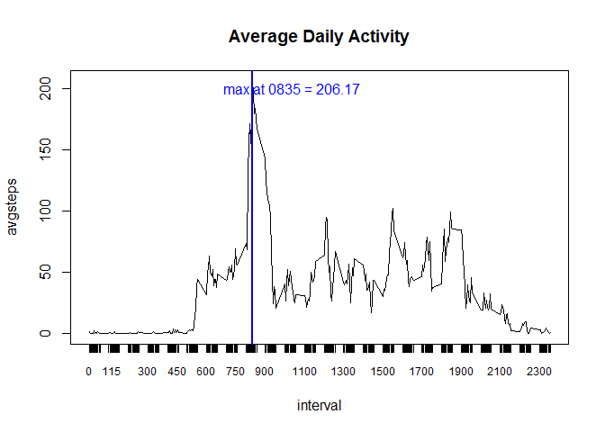

# Reproducible Research: Peer Assessment 1


## Loading and preprocessing the data##


- Data source


[Activity Monitoring Data](https://d396qusza40orc.cloudfront.net/repdata%2Fdata%2Factivity.zip)


```r
library(utils)
unzip("activity.zip")
activity <- read.csv("activity.csv")

##saving date-time from date and interval

date <- as.Date(activity$date)
time <- sprintf("%04d", activity$interval)
datetime <- paste(date,time, sep =" ")
datetime <- strptime(datetime, format = "%Y-%m-%d %H%M", tz ="")
activity$datetime <- datetime

head(activity)
```

```
##   steps       date interval            datetime
## 1    NA 2012-10-01        0 2012-10-01 00:00:00
## 2    NA 2012-10-01        5 2012-10-01 00:05:00
## 3    NA 2012-10-01       10 2012-10-01 00:10:00
## 4    NA 2012-10-01       15 2012-10-01 00:15:00
## 5    NA 2012-10-01       20 2012-10-01 00:20:00
## 6    NA 2012-10-01       25 2012-10-01 00:25:00
```

 

## What is mean total number of steps taken per day?

```r
#sum up the steps taken by day into a new vector

aggregatedata <- aggregate(activity$steps, by = list(date), FUN = sum)
names(aggregatedata)<- c("date", "avgstepsday")
head(aggregatedata)
```

```
##         date avgstepsday
## 1 2012-10-01          NA
## 2 2012-10-02         126
## 3 2012-10-03       11352
## 4 2012-10-04       12116
## 5 2012-10-05       13294
## 6 2012-10-06       15420
```

```r
mean(aggregatedata$avgstepsday, na.rm = TRUE)
```

```
## [1] 10766.19
```

```r
median(aggregatedata$avgstepsday, na.rm = TRUE)
```

```
## [1] 10765
```


```r
png('./figure-html/unnamed-chunk-3-1.png',width=800,height=600)

hist(aggregatedata$avgstepsday, col = "grey", xlab = "No. of steps per day", main = "No. of steps per day")
abline(v = mean(aggregatedata$avgstepsday, na.rm = TRUE), col = "blue")
text(13000, 25, "mean = 10,770", col = "blue")
rug(aggregatedata$avgstepsday)

dev.off()
```

```
## png 
##   2
```


## What is the average daily activity pattern?


```r
aggbyinterval <- aggregate(activity$steps, by = list(activity$interval), FUN = mean, na.rm = TRUE)
names(aggbyinterval)<- c("interval", "avgsteps")
head(aggbyinterval)
```

```
##   interval  avgsteps
## 1        0 1.7169811
## 2        5 0.3396226
## 3       10 0.1320755
## 4       15 0.1509434
## 5       20 0.0754717
## 6       25 2.0943396
```

**Which 5-minute interval, on average across all the days in the dataset, contains the maximum number of steps?**

```r
aggbyinterval[which.max(aggbyinterval$avgsteps),]$interval
```

```
## [1] 835
```


```r
with(aggbyinterval, plot(interval, avgsteps, type = "l", main = "Average Daily Activity", xaxt = "n"))
axis(1, at = aggbyinterval$interval, cex.axis = 0.75)

abline(v = aggbyinterval[which.max(aggbyinterval$avgsteps),]$interval, col = "blue", lwd = 2)
text(aggbyinterval[which.max(aggbyinterval$avgsteps),]$interval + 200, 200, "max at 0835 = 206.17", col = "blue")
```

\


## Imputing missing values

Calculate and report the total number of missing values in the dataset (i.e. the total number of rows with NAs)


```r
sum(is.na(activity$steps))
```

```
## [1] 2304
```


**2304 rows with missing values**

Devise a strategy for filling in all of the missing values in the dataset. 

Replacing missing values with the avg. steps taken during that time interval across all days


```r
#merging avg. steps by interval into a new data set
newactivity <- merge(activity, aggbyinterval, by = "interval")
newactivity <- newactivity[order(newactivity$date),]
head(newactivity)
```

```
##     interval steps       date            datetime  avgsteps
## 1          0    NA 2012-10-01 2012-10-01 00:00:00 1.7169811
## 63         5    NA 2012-10-01 2012-10-01 00:05:00 0.3396226
## 128       10    NA 2012-10-01 2012-10-01 00:10:00 0.1320755
## 205       15    NA 2012-10-01 2012-10-01 00:15:00 0.1509434
## 264       20    NA 2012-10-01 2012-10-01 00:20:00 0.0754717
## 327       25    NA 2012-10-01 2012-10-01 00:25:00 2.0943396
```

```r
newactivity$steps[is.na(newactivity$steps)] <- newactivity$avgsteps[is.na(newactivity$steps)]
head(newactivity)
```

```
##     interval     steps       date            datetime  avgsteps
## 1          0 1.7169811 2012-10-01 2012-10-01 00:00:00 1.7169811
## 63         5 0.3396226 2012-10-01 2012-10-01 00:05:00 0.3396226
## 128       10 0.1320755 2012-10-01 2012-10-01 00:10:00 0.1320755
## 205       15 0.1509434 2012-10-01 2012-10-01 00:15:00 0.1509434
## 264       20 0.0754717 2012-10-01 2012-10-01 00:20:00 0.0754717
## 327       25 2.0943396 2012-10-01 2012-10-01 00:25:00 2.0943396
```


Make a histogram of the total number of steps taken each day and Calculate and report the mean and median total number of steps taken per day. 


```r
newagg <- aggregate(newactivity$steps, by = list(date), FUN = sum)
names(newagg) <- c("date","avgstepsday")
summary(newagg$avgstepsday)
```

```
##    Min. 1st Qu.  Median    Mean 3rd Qu.    Max. 
##      41    9819   10770   10770   12810   21190
```

```r
hist(newagg$avgstepsday, col = "grey", xlab = "No. of steps per day", main = "No. of steps per day")
abline(v = mean(newagg$avgstepsday, na.rm = TRUE), col = "blue")
rug(newagg$avgstepsday)
```

\

Do these values differ from the estimates from the first part of the assignment? What is the impact of imputing missing data on the estimates of the total daily number of steps?

**The median is closer to the mean once imputed values are used**

## Are there differences in activity patterns between weekdays and weekends?


```r
newactivity$weekend <- weekdays(newactivity$datetime, abbreviate = TRUE) == "Sun" | weekdays(newactivity$datetime, abbreviate = TRUE) == "Sat"

newactivity$weekday <- !newactivity$weekend

## long way to get avg steps by intervals across weekends and weekdays separately. Still learning how to create functions so this is all a bit manual. 

weekdaydata <- subset(newactivity, weekend == FALSE)
weekenddata <- subset(newactivity, weekend == TRUE)

aggbyintervalWeekend <- aggregate(weekenddata$steps, by = list(weekenddata$interval), FUN = mean, na.rm = TRUE)
names(aggbyintervalWeekend)<- c("interval", "avgsteps2")
weekenddata <- merge(weekenddata, aggbyintervalWeekend, by = "interval")

aggbyintervalWeekday <- aggregate(weekdaydata$steps, by = list(weekdaydata$interval), FUN = mean, na.rm = TRUE)
names(aggbyintervalWeekday)<- c("interval", "avgsteps2")
weekdaydata <- merge(weekdaydata, aggbyintervalWeekday, by = "interval")

library(gridExtra)
require(gridExtra)
library(lattice)

plot1<- xyplot(avgsteps2 ~ interval, data = weekenddata, type ="l", ylab ="avg. no of steps", main ="weekend")

plot2<- xyplot(avgsteps2 ~ interval, data = weekdaydata, type ="l", ylab = "avg. no of steps", main ="weekday")

grid.arrange(plot1,plot2, nrow = 2)
```

\

